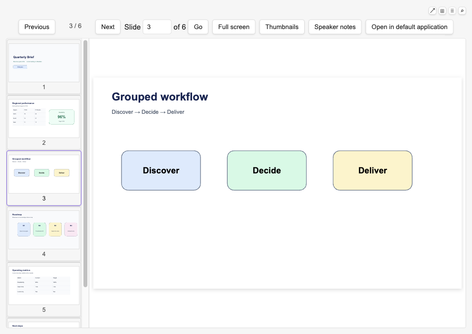
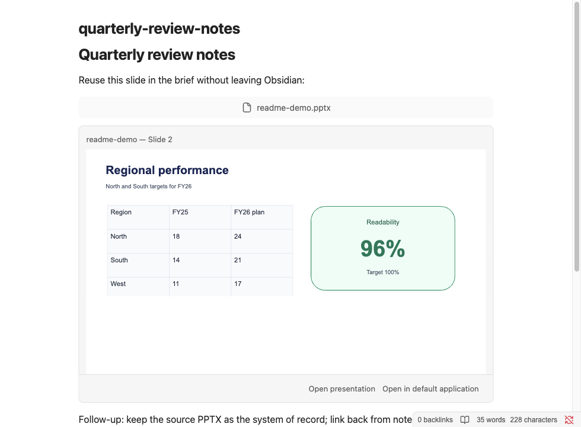
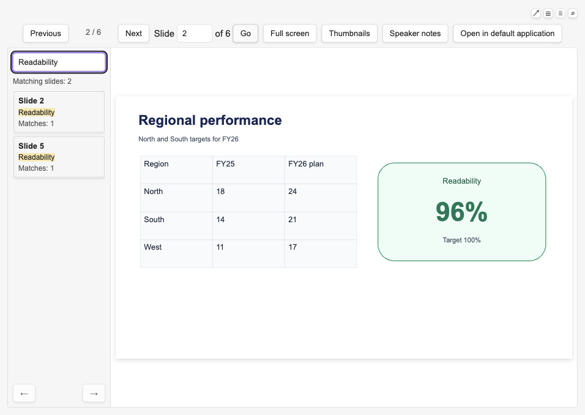

<p align="center">
  
</p>

<h1 align="center">Office Viewer</h1>

<p align="center">
  <strong>Read and search local PowerPoint presentations and Word documents
  in Obsidian.</strong>
</p>

<p align="center">
  Read locally · Search PPTX and DOCX · Reference exact slides · Keep sources
  unchanged
</p>

<p align="center">
  <a href="README.zh-Hans.md">简体中文</a>
</p>

Office Viewer opens local `.pptx` presentations and `.docx` Word documents in
desktop Obsidian without conversion or upload. PPTX keeps its slide-reference
and embed workflows; DOCX deliberately focuses on continuous reading and
search within the current document.

The current release is **0.2.4**. GitHub receives the release first; Obsidian
Community Plugins may follow after its catalog refreshes.



## Install

**Obsidian Community Plugins (recommended)**

1. Open **Settings → Community plugins**.
2. Enable Community plugins if needed, then open **Browse**.
3. Search for **Office Viewer**, install it, and enable the plugin.

**GitHub Release**

Download `main.js`, `manifest.json`, and `styles.css` from
[GitHub Releases](https://github.com/jerry4pan/obsidian-office-viewer-plugin/releases/latest)
into `<Vault>/.obsidian/plugins/office-viewer/`, reload Obsidian, and enable
**Office Viewer**.

## Feedback and support

- **Report a problem:** use the
  [Bug report form](https://github.com/jerry4pan/obsidian-office-viewer-plugin/issues/new?template=bug-report.yml).
- **Request an improvement:** use the
  [Feature request form](https://github.com/jerry4pan/obsidian-office-viewer-plugin/issues/new?template=feature-request.yml).
- **Share your real workflow:** start a
  [Workflow story](https://github.com/jerry4pan/obsidian-office-viewer-plugin/discussions/categories/workflow-stories).
- **Ask a question:** use
  [GitHub Discussions Q&A](https://github.com/jerry4pan/obsidian-office-viewer-plugin/discussions/categories/q-a).
- **Security vulnerabilities:** use the private reporting described in
  `SECURITY.md`.

Bug reports should use the latest release and include **Copy diagnostic
summary** when available. Never upload confidential presentations, screenshots
containing sensitive content, filenames, paths, slide text, or images.

## Features

**Reading**

- Open `.pptx` files directly from your Vault and read them slide by slide.
- Navigate with Previous / Next buttons, jump to any slide by number, or use
  `ArrowLeft` / `ArrowRight` and `PageUp` / `PageDown` keys.
- Each open file has its own independent reading position, thumbnail scroll
  state, and full-screen state across workspace panels.
- The current slide always fills the available reading area automatically.

**Word document reading and search**

- Open `.docx` files directly from the Vault in a continuous, read-only view.
- Read final-view main-body headings, paragraphs, lists, tables, inline images,
  and safe hyperlinks. Headers, footers, comments, text boxes, and deleted or
  hidden text are outside the DOCX view.
- Common embedded raster images, placeable Windows metafiles (WMF/EMF payloads
  that convert locally), and Office charts with usable cached series data are
  shown as preview images. Exact Word print layout is not claimed.
- Press `Cmd+F` or `Ctrl+F` to open the document search panel and focus its
  field; `Escape` closes it. Search covers visible main-body text in the current
  document only. Results are one entry per matching paragraph, with a match
  count and excerpt, and jump to a visible session-only highlight.
- Very large documents use a clearly labelled simplified reading mode with a
  bounded DOM. Detected content that cannot be represented is marked in flow
  with a document-level notice.
- DOCX does not create stable paragraph references, embeds, companion notes,
  persistent reading positions, or a Vault-wide search index.

**Thumbnails**

- A scrollable thumbnail strip shows previews of all slides alongside the main
  view.
- Thumbnails render progressively, starting with the slide you are on.
- Drag the right edge of the thumbnail strip to resize previews, double-click
  to reset, or use keyboard arrows when the divider is focused.

**Full screen**

- Enter full screen to use the full display while keeping the toolbar and
  thumbnail strip accessible.
- Exit with the on-screen control or the platform Escape key.

**Fallback**

- **Open in default application** sends the file to PowerPoint, Keynote, Word,
  Pages, or your system default when the preview is not enough.

**Slide references and embeds**



- **Copy slide reference** creates a source-preserving Vault wikilink that
  returns to the same native slide even after slides are reordered.
- **Copy slide embed** creates the same stable reference as a live,
  source-backed single-slide embed in Markdown Reading View and, for a
  standalone canonical embed line, in Live Preview.
- Select visible text on the current slide to use **Copy selected text with
  source**. Ordinary `Cmd+C` / `Ctrl+C` remains unchanged; the explicit action
  copies the selected text followed by the stable slide reference.
- In Live Preview, only a canonical PPTX single-slide embed that is the sole
  non-whitespace content on its line becomes an inline widget. Cursor,
  selection, or a click on the slide canvas reveals the exact Markdown; only
  the explicit source action opens the PPTX. Source mode always shows syntax.
  Plain `![[deck.pptx]]`, prose-mixed, or multi-embed lines stay ordinary
  Markdown.
- Deleted slides and missing presentations fail explicitly without silently
  falling back to an ordinal position.

**Speaker notes**

- Expand the current-slide speaker notes panel to read author note paragraphs
  without leaving Obsidian. The panel starts collapsed and keeps your choice
  while you navigate within the same view.
- Copy speaker notes as plain text with the canonical slide reference when the
  current slide has usable notes.
- Notes-master text, headers, footers, dates, and slide numbers are never shown
  as speaker notes.

**Presentation content search**



- Press `Cmd+F` or `Ctrl+F` in an open PPTX to search that presentation. When
  speaker notes are available, search defaults to slides and notes together and
  offers All / Slides / Notes scope filters for the current view only.
- Search covers source-authored titles, body text, text boxes, shape text,
  table cells, and author speaker notes. Results stay local to the current view
  and are never persisted.
- Images, master/layout text, charts, SmartArt, OCR, Vault-wide indexing, and
  highlighting on the main rendered slide are not searched.

**Error handling**

- Corrupted, encrypted, or otherwise unreadable PPTX or DOCX files show a clear
  explanation rather than a blank screen or a cryptic error.
- Legacy `.ppt` files are recognized and explained without attempting to parse
  them. Legacy `.doc` and macro-enabled `.docm` are not registered.
- Compatible files that run into a rendering problem show a warning while
  keeping the last readable slide or document content visible when possible.

**Reading position**

- **Remember reading position** (on by default) reopens each file at the slide
  you left off.
- Stores only a Vault-relative path, file size, modification time, slide index,
  and update timestamp. It does not store slide text, images, paths outside the
  Vault, or author metadata. Turn it off at any time to clear saved positions
  instantly. Explicitly claimed companion-note path pairs are stored separately
  and are not cleared by this setting.

**Presentation companion note**

- From an open `.pptx` viewer, use **Open companion note** to create or claim
  one same-directory, same-basename Markdown note for presentation-level
  writing. Merely opening a PPTX does not write the Vault.
- Newly created notes contain only a heading and an ordinary wikilink to the
  source PPTX. Existing same-name Markdown is adopted unchanged.
- The source PPTX remains read-only. Plugin data stores only the two
  Vault-relative paths for a claimed relationship.

**Compatibility awareness**

- **Diagnostic summary** is off by default.
- When enabled, detectable unsupported media or missing fonts show a persistent
  banner on the next open, retry, or reload of that file.
- Blocking errors, retry, and **Open in default application** stay visible
  regardless of the diagnostic setting.

**Diagnostic summary**

- Turn on **Diagnostic summary** in settings to show compatibility warnings and
  the copy control on the next open, retry, or reload.
- **Copy diagnostic summary** captures versions, file size, slide count,
  timings, and stable categories for troubleshooting. It excludes filenames,
  paths, slide text, images, and any personal or rendered content.

**Languages**

- The interface supports English, Simplified Chinese, and Traditional Chinese,
  following your Obsidian language setting. Other languages fall back to
  English.

**Privacy**

- Everything stays local. The plugin never uploads files, phones home, or
  collects telemetry. Source PPTX and DOCX files are never modified. Companion
  notes are Markdown files created only by an explicit action; plugin data
  stores only their Vault-relative path pairs. PPTX and DOCX search queries,
  extracted text, snippets, and results are session-local and are not saved.

## Development install

Requirements: desktop Obsidian, Node.js 22, and npm.

```bash
npm install
npm run build
mkdir -p /path/to/vault/.obsidian/plugins/office-viewer
cp main.js manifest.json styles.css /path/to/vault/.obsidian/plugins/office-viewer/
```

Enable **Office Viewer** under Community plugins, then open a `.pptx` or
`.docx` from the Vault file explorer. Rebuild and copy the same three files after source
changes. `npm run test:e2e` performs the equivalent build-and-install path in a
sandboxed test Vault without using a personal Obsidian configuration.

## Packaged install, upgrade, and uninstall

A release ZIP contains the three runtime files (`main.js`, `manifest.json`,
and `styles.css`) plus the project license, attribution notice, and bundled
renderer licenses. GitHub Releases publish only the three Obsidian runtime
files (with build provenance attestations); the full ZIP stays available as the
tag CI artifact from `npm run release:package`. Extract the ZIP contents to
`<Vault>/.obsidian/plugins/office-viewer/`, reload Obsidian, and enable
**Office Viewer**. To upgrade, disable the plugin, replace all three runtime
files together, reload Obsidian, and re-enable it. To uninstall, disable the
plugin and remove the `office-viewer` directory; the plugin never writes to
source PPTX or DOCX files.

## Development

```bash
npm install
npm run fixtures
npm run verify
npm run test:e2e
npm run test:e2e:docx
npm run test:compatibility
npm run test:compatibility:docx
npm run test:performance
npm run test:performance:docx
npm run test:performance:baseline
npm run release:check
npm run release:package
npm run test:release
```

`npm run test:e2e` downloads and launches a sandboxed Obsidian instance. It
does not use the normal Obsidian configuration or a personal Vault. Six cases
exercise the production adapter; a separate installed case uses a test-only
adapter to inject one recoverable slide failure, then rebuilds the production
bundle before exiting.

`npm run test:compatibility` opens the representative corpus through the same
installed plugin path, captures fixed-environment screenshots, compares them
with approved visual baselines, and writes ignored run artifacts under
`artifacts/compatibility/`. The first renderer currently scores 90.0% readable
main content and meets the 80% M0 gate with known SVG degradation; see
`docs/compatibility/aiden-pptx-renderer-1.2.4.md`.

`npm run test:compatibility:docx` uses a pinned installed Obsidian environment
and requires at least 90% readable main-body content. The accepted result is
100%; see `docs/compatibility/docx-preview-0.3.6.md`.

`npm run test:performance` repeats the installed-Obsidian benchmark on the
current machine and writes ignored evidence under
`artifacts/performance/aiden-pptx-renderer-1.2.4/`. The committed
reference-machine result for `@aiden0z/pptx-renderer@1.2.4` is
`tests/performance/baselines/aiden-pptx-renderer-1.2.4.json`, with the matching
human-readable report in
`docs/performance/aiden-pptx-renderer-1.2.4.md`. Validate the committed evidence
shape and fixed gate calculation with `npm run test:performance:baseline`.

`npm run test:performance:docx` measures DOCX first-readable, search-ready,
query, cleanup, stress DOM, and heap budgets in installed Obsidian. The accepted
baseline is documented in `docs/performance/docx-preview-0.3.6.md`.

To refresh the reference baseline, run `npm run test:performance` without
changing its samples or thresholds, inspect the recorded verdict, then copy
`artifacts/performance/aiden-pptx-renderer-1.2.4/results.json` and
`artifacts/performance/aiden-pptx-renderer-1.2.4/summary.md` byte-for-byte over
those two committed files. Run
`npm run test:performance:baseline` after the copy. A budget miss remains valid
evidence and must be committed as FAIL rather than tuned away.

`npm run release:check` validates package, manifest, compatibility-version,
supported-extension, license, and required-documentation consistency without
requiring a version bump on `main`.
`npm run release:check:publish` adds tag, commit, and GitHub-release guards
for tagged releases only. Publish releases with the plain manifest version as
the tag and release name, for example `0.2.1`, not `v0.2.1`; Obsidian matches
the GitHub release directly against `manifest.json`.
`npm run release:package` creates a
deterministic `dist/office-viewer-<version>.zip`. `npm run test:release`
installs that extracted ZIP into a clean test Vault, opens real PPTX and DOCX
fixtures,
rehearses an in-place package upgrade, and verifies disable/removal without
network access or source mutation. Tag CI requires the exact manifest version
as the tag name, runs publish checks, attests `main.js` / `manifest.json` /
`styles.css`, proves a second package build is byte-identical, uploads the ZIP
as a workflow artifact, and publishes only those three attested files to the
GitHub Release.

## Current boundaries

- `.pptx` and `.docx` are parsed. Legacy `.ppt` receives an explicit local
  explanation and external-open fallback; legacy `.doc` and macro-enabled
  `.docm` are not registered.
- Read-only and local; the plugin never writes back to the source file.
- Desktop Obsidian only; mobile and tablet are not supported.
- No Office, LibreOffice, PDF conversion, cloud renderer, or document server.
- Normal viewing does not upload presentation or document content, follow
  external relationships, execute macros/scripts, or make a network request.
- Rendering is a readable preview, not pixel-perfect PowerPoint or Word
  fidelity. Embedded SVG, unsupported chart types, and other advanced content
  can degrade or show in-flow placeholders. Use **Open in default application**
  when the preview is not trustworthy.
- Detectable unsupported media and unavailable fonts show compatibility
  warnings only when **Diagnostic summary** is enabled. Unknown PowerPoint or
  Word differences may still exist.
- Privacy and security details are in `PRIVACY.md` and `SECURITY.md`.
- Editing, saving, animations, legacy `.ppt`/`.doc` parsing, OCR, Vault-wide
  search, main-slide search highlighting, DOCX paragraph references or embeds,
  multi-slide or full-deck embeds, prose-mixed or multi-embed Live Preview
  lines, telemetry, accounts, licensing, and cloud services are out of scope.

## Test fixture

The committed minimal presentation is generated from repository-authored
content with PptxGenJS. See `tests/fixtures/README.md` for provenance.

Office Viewer is an open-source project by
[Jerry Pan](https://github.com/jerry4pan).
