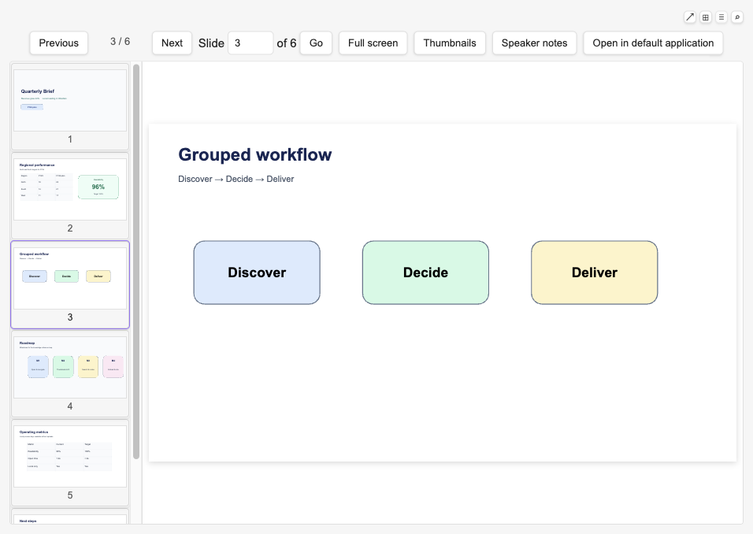
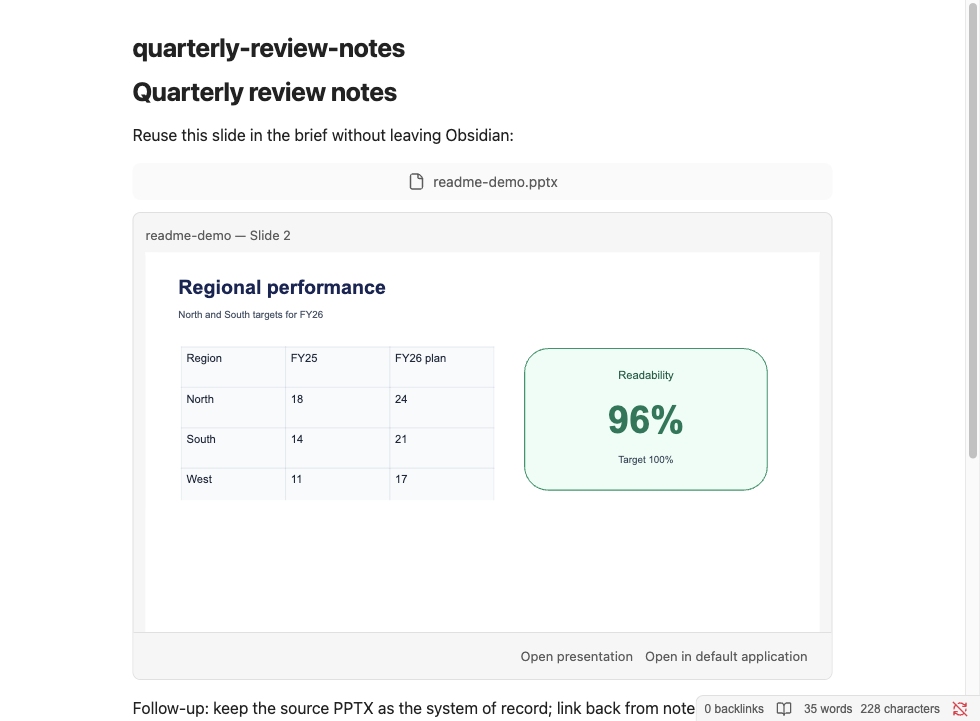
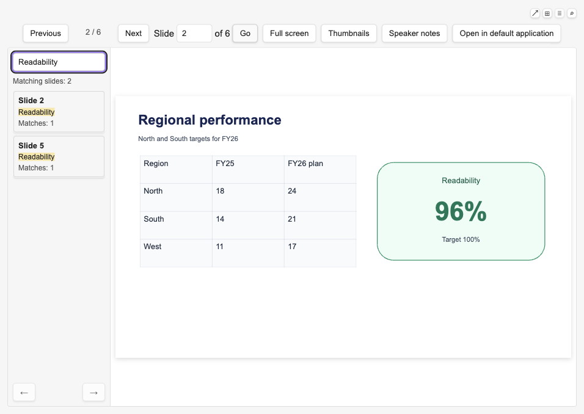

# Obsidian Office Viewer

在桌面版 Obsidian 中直接阅读本地 `.pptx` 文件——无需转 PDF、无需上传、无网络请求。

完整说明、开发与发布流程以英文 [README.md](README.md) 为准。本文是面向中文用户的摘要。

## 安装

**Obsidian 社区插件（推荐）**

1. 打开 **设置 → 社区插件**。
2. 如需先启用社区插件，再打开 **浏览**。
3. 搜索 **Office Viewer**，安装并启用。

**GitHub Release**

从
[GitHub Releases](https://github.com/jerry4pan/obsidian-office-viewer-plugin/releases/latest)
下载 `main.js`、`manifest.json`、`styles.css` 到
`<Vault>/.obsidian/plugins/office-viewer/`，重载 Obsidian 后启用
**Office Viewer**。

## 功能概要

- 在库中打开 `.pptx`，按页阅读；支持按钮、页码跳转与方向键。
- 缩略图条可滚动、渐进渲染，并可拖拽调整宽度。
- 支持全屏阅读；预览不够时可用 **在默认应用中打开**（如 PowerPoint、Keynote）。
- 可复制稳定的**幻灯片引用**，即使演示文稿重排，也能按原生幻灯片 ID 返回同一页。
- 可复制**幻灯片嵌入**，在 Markdown 阅读视图中显示来源驱动的单页内容；独占一行的规范嵌入在 Live Preview 中也会原地渲染。

- 在 Live Preview 中，仅当规范 PPTX 单页嵌入是该行唯一非空白内容时才会变成行内部件。光标、选区或点击幻灯片画面会恢复完整可编辑 Markdown；只有明确的来源操作才会打开 PPTX。Source 模式始终只显示语法。普通 `![[deck.pptx]]`、与正文混排、或多嵌入同行仍保持普通 Markdown。
- 被引用页已删除或源演示文稿缺失时会明确提示，不会静默退回旧页码。
- 可展开当前页**讲者备注**面板阅读作者备注，并可连同稳定幻灯片引用一并复制。

- 在打开的 PPTX 中按 `Cmd+F` 或 `Ctrl+F`，可搜索当前演示文稿自己编写的标题、正文、文本框、形状文字、表格单元格和讲者备注；有备注时支持全部 / 幻灯片 / 讲者备注范围筛选。
- 搜索查询、源文字、片段和结果仅存在于当前视图会话，不会持久化。图片、母版/版式文字、图表和 SmartArt 不在搜索范围内。
- 默认记住阅读位置（仅存库内相对路径、文件大小、修改时间、页码与时间戳）。
- **诊断摘要** 默认关闭；开启后可显示可检测的兼容性提示，并复制不含内容的诊断信息。
- 界面跟随 Obsidian 语言，支持英文、简体中文、繁体中文；其他语言回退到英文。
- 全程本地、只读；不上传文件、不收集遥测、不修改源文件，也不保存搜索内容。

## 反馈

- **缺陷** 与 **功能建议**：请开
  [GitHub Issue](https://github.com/jerry4pan/obsidian-office-viewer-plugin/issues)。
  请勿用 Pull Request 报告缺陷或提出功能需求。
- **安全漏洞**：按 `SECURITY.md` 使用私密报告渠道。
- 贡献与报告细节见 `CONTRIBUTING.md`（英文）。

报告缺陷前请先用最新版本复现，并在相关阅读视图中使用 **复制诊断摘要**。不要上传含敏感内容的演示文稿、截图、文件名、路径或原文。

## 当前边界

- 仅解析 `.pptx`；旧版 `.ppt` 会给出本地说明，并引导用默认应用打开。
- 只读、本地；不回写源文件。
- 仅桌面版 Obsidian；不支持手机与平板。
- 不做 Office / LibreOffice / PDF 转换，也不使用云端渲染或文档服务器。
- 正常阅读不会上传演示内容、不会自动跟随外部关系、不会执行宏/脚本、不会发网络请求。
- 渲染是可读预览，不是像素级还原；嵌入 SVG 等高级内容可能降级。预览不可信时请用 **在默认应用中打开**。
- 可检测的不支持媒体与缺失字体，仅在开启 **诊断摘要** 时显示警告；仍可能存在未知的 PowerPoint 差异。
- 编辑、保存、动画、解析旧版 `.ppt`、OCR、全库搜索、主画面搜索高亮、多页或整份演示文稿嵌入、与正文混排或多嵌入同行的 Live Preview 渲染、遥测、账号、授权与云服务均不在范围内。

隐私与安全细节见 `PRIVACY.md` 与 `SECURITY.md`。
